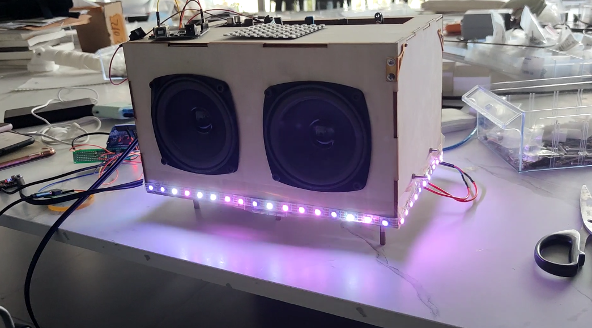
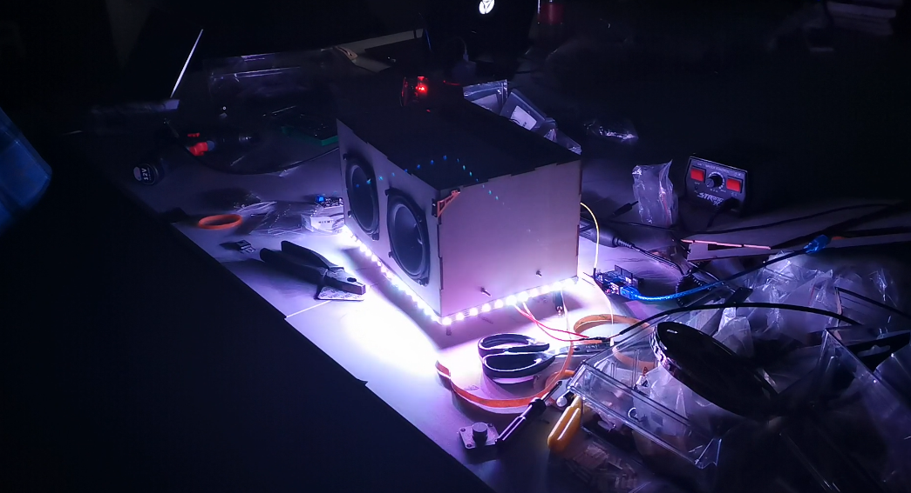
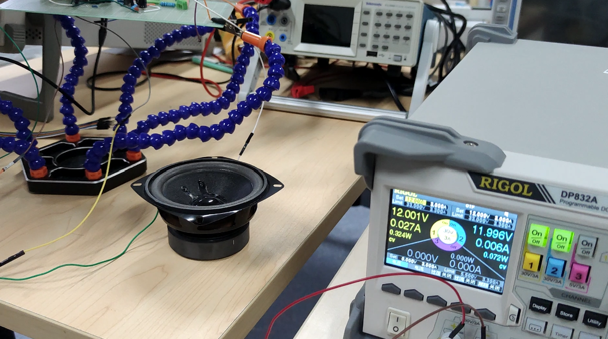

# LED Bluetooth Speaker

In this project, I was responsible for designing the power amplifier circuit and conducting simulations in Multisim.

The other parts of this project, including the lights that flash with the music rhythm and the casing, were handled by my teammates.

  
  

The amplifier circuit design referred to some cases on internet. Final version was like:

And Simulated and drawed a Bode plot in Multisim, observed the frequency response characteristics, and ensured that it doesn't self-oscillate. 

After simulation, we tested the real affect of the speaker.

